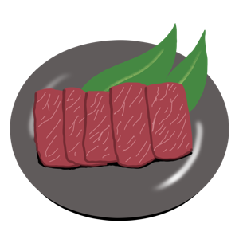

# 焼き肉レトロスペクティブ イラスト集

  

このリポジトリには「焼き肉レトロスペクティブ」の歌のイラスト集が含まれています。イラストは2つのサイズで提供されています：

- 大サイズ（Large）: 1280px x 1280px
- 小サイズ（Small）: 300px x 300px

## イラスト一覧

### 肉のイラスト

<table>
  <tr>
    <td align="center">
       
      <b>ハラミ</b> 
      <a href="large/meat/meat_harami.png">大サイズ</a> | <a href="small/meat/meat_harami.png">小サイズ</a>
    </td>
    <td align="center">
       
      <b>タン塩</b> 
      <a href="large/meat/meat_tongue.png">大サイズ</a> | <a href="small/meat/meat_tongue.png">小サイズ</a>
    </td>
    <td align="center">
       
      <b>カルビ</b> 
      <a href="large/meat/meat_kalbi.png">大サイズ</a> | <a href="small/meat/meat_kalbi.png">小サイズ</a>
    </td>
  </tr>
  <tr>
    <td align="center">
       
      <b>ホルモン</b> 
      <a href="large/meat/meat_horumon.png">大サイズ</a> | <a href="small/meat/meat_horumon.png">小サイズ</a>
    </td>
    <td align="center">
       
      <b>ザブトン</b> 
      <a href="large/meat/meat_zabuton.png">大サイズ</a> | <a href="small/meat/meat_zabuton.png">小サイズ</a>
    </td>
    <td align="center">
       
      <b>ロース</b> 
      <a href="large/meat/meat_roast.png">大サイズ</a> | <a href="small/meat/meat_roast.png">小サイズ</a>
    </td>
  </tr>
  <tr>
    <td align="center">
       
      <b>豚トロ</b> 
      <a href="large/meat/meat_butabara.png">大サイズ</a> | <a href="small/meat/meat_butabara.png">小サイズ</a>
    </td>
    <td align="center">
       
      <b>ピートロ</b> 
      <a href="large/meat/meat_pietro.png">大サイズ</a> | <a href="small/meat/meat_pietro.png">小サイズ</a>
    </td>
    <td align="center">
       
      <b>鶏肉</b> 
      <a href="large/meat/meat_chicken.png">大サイズ</a> | <a href="small/meat/meat_chicken.png">小サイズ</a>
    </td>
  </tr>
  <tr>
    <td align="center">
       
      <b>レバー</b> 
      <a href="large/meat/meat_liver.png">大サイズ</a> | <a href="small/meat/meat_liver.png">小サイズ</a>
    </td>
    <td align="center">
       
      <b>ボンジリ</b> 
      <a href="large/meat/meat_bonjiri.png">大サイズ</a> | <a href="small/meat/meat_bonjiri.png">小サイズ</a>
    </td>
    <td></td>
  </tr>
</table>

### 海鮮類

<table>
  <tr>
    <td align="center">
       
      <b>ホタテ</b> 
      <a href="large/seafood/seafood_hotate.png">大サイズ</a> | <a href="small/seafood/seafood_hotate.png">小サイズ</a>
    </td>
    <td align="center">
       
      <b>エビ</b> 
      <a href="large/seafood/seafood_ebi.png">大サイズ</a> | <a href="small/seafood/seafood_ebi.png">小サイズ</a>
    </td>
    <td align="center">
       
      <b>タコ</b> 
      <a href="large/seafood/seafood_tako.png">大サイズ</a> | <a href="small/seafood/seafood_tako.png">小サイズ</a>
    </td>
  </tr>
  <tr>
    <td align="center">
       
      <b>海鮮焼き</b> 
      <a href="large/seafood/seafood_kaisen.png">大サイズ</a> | <a href="small/seafood/seafood_kaisen.png">小サイズ</a>
    </td>
    <td></td>
    <td></td>
  </tr>
</table>

### ご飯もの

<table>
  <tr>
    <td align="center">
       
      <b>石焼きビビンバ</b> 
      <a href="large/rice_dishes/rice_bibimbap.png">大サイズ</a> | <a href="small/rice_dishes/rice_bibimbap.png">小サイズ</a>
    </td>
    <td align="center">
       
      <b>クッパ</b> 
      <a href="large/rice_dishes/rice_kuppa.png">大サイズ</a> | <a href="small/rice_dishes/rice_kuppa.png">小サイズ</a>
    </td>
    <td align="center">
       
      <b>焼肉締め系</b> 
      <a href="large/rice_dishes/rice_meal_finishers.png">大サイズ</a> | <a href="small/rice_dishes/rice_meal_finishers.png">小サイズ</a>
    </td>
  </tr>
</table>

### サイドメニュー

<table>
  <tr>
    <td align="center">
       
      <b>キムチ</b> 
      <a href="large/sidedish/sidedish_kimchi.png">大サイズ</a> | <a href="small/sidedish/sidedish_kimchi.png">小サイズ</a>
    </td>
    <td align="center">
       
      <b>キャベツ</b> 
      <a href="large/sidedish/sidedish_cabbage.png">大サイズ</a> | <a href="small/sidedish/sidedish_cabbage.png">小サイズ</a>
    </td>
    <td align="center">
       
      <b>韓国のり</b> 
      <a href="large/sidedish/sidedish_nori.png">大サイズ</a> | <a href="small/sidedish/sidedish_nori.png">小サイズ</a>
    </td>
  </tr>
  <tr>
    <td align="center">
       
      <b>ホイール焼き</b> 
      <a href="large/sidedish/sidedish_hoil.png">大サイズ</a> | <a href="small/sidedish/sidedish_hoil.png">小サイズ</a>
    </td>
    <td></td>
    <td></td>
  </tr>
</table>

### その他

<table>
  <tr>
    <td align="center">
       
      <b>店長転調でーす</b> 
      <a href="large/others/master_tencho.png">大サイズ</a> | <a href="small/others/master_tencho.png">小サイズ</a>
    </td>
    <td></td>
    <td></td>
  </tr>
</table>

### レトロデザイン

<table>
  <tr>
    <td align="center">
       
      <b>スマホ待ち受け</b> 
      <a href="large/retro/yakiniku_retro_smartphone.png">大サイズ</a> | <a href="small/retro/yakiniku_retro_smartphone.png">小サイズ</a>
    </td>
    <td align="center">
       
      <b>アイキャッチ1</b> 
      <a href="large/retro/yakiniku_retro_eyecatch1.png">大サイズ</a> | <a href="small/retro/yakiniku_retro_eyecatch1.png">小サイズ</a>
    </td>
    <td align="center">
       
      <b>アイキャッチ2</b> 
      <a href="large/retro/yakiniku_retro_eyecatch2.png">大サイズ</a> | <a href="small/retro/yakiniku_retro_eyecatch2.png">小サイズ</a>
    </td>
  </tr>
  <tr>
    <td align="center">
       
      <b>背景</b> 
      <a href="large/retro/yakiniku_retro_background.png">大サイズ</a> | <a href="small/retro/yakiniku_retro_background.png">小サイズ</a>
    </td>
    <td></td>
    <td></td>
  </tr>
</table>

## 使用方法

これらのイラストは以下のような用途でご利用いただけます：
- プレゼンテーション
- ドキュメント
- ウェブサイト
- イベント資料
- チャットやメッセージでのリアクション画像
- ブログ記事の挿絵
- 勉強会や社内イベントの素材

## ライセンス

このイラスト集はCC BY-NC-ND 4.0ライセンスの下で提供されています。
