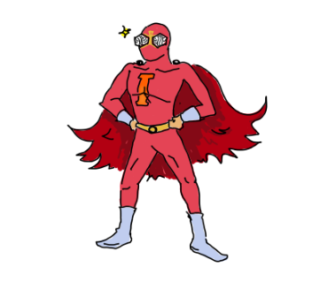
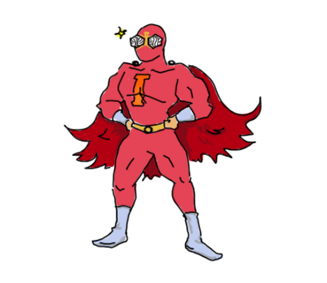
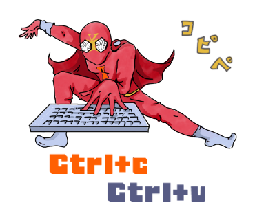

# インナーソースマンイラスト集

このリポジトリには、インナーソースマンのさまざまなイラストが含まれています。これらのイラストは、インナーソースの概念や価値を視覚的に表現するために作成されました。

## イラストギャラリー

### キャラクターバリエーション

<table>
  <tr>
    <td align="center">
       
      <a href="./character/character-no-text.png" download>InnerSource Man (Basic)</a> 
      <small>No Text Version</small>
    </td>
    <td align="center">
       
      <a href="./character/character-no-text-muscle.png" download>InnerSource Man (Muscle)</a> 
      <small>Muscle Version</small>
    </td>
  </tr>
</table>

### シーン別イラスト

<table>
  <tr>
    <td align="center">
       
      <a href="./character/character-copy.png" download>Copy and Paste</a> 
      <small>コピー&ペーストの表現</small>
    </td>
    <td align="center">
       
      <a href="./character/lets-make-it-innersource.png" download>Let's make it InnerSource</a> 
      <small>「それ、インナーソースにしよう」</small>
    </td>
    <td align="center">
       
      <a href="./character/thanks-for-readme.png" download>Thanks for README</a> 
      <small>「README.mdありがてぇ」</small>
    </td>
  </tr>
</table>

<table>
  <tr>
    <td align="center">
       
      <a href="./character/no-readme.png" download>No README</a> 
      <small>「READMEがない」</small>
    </td>
    <td align="center">
       
      <a href="./character/reinventing-the-wheel.png" download>Reinventing the Wheel</a> 
      <small>「インナーソースマン車輪再発明」</small>
    </td>
    <td align="center">
       
      <a href="./character/feeling-down.png" download>Feeling Down</a> 
      <small>「凹むわ〜」</small>
    </td>
  </tr>
  <tr>
    <td align="center">
       
      <a href="./character/putting-away-man.png" download>Putting Away</a> 
      <small>「しまっちゃうおじさん」</small>
    </td>
  </tr>
</table>

### ロゴ

<table>
  <tr>
    <td align="center">
       
      <a href="./logo/innersource-man-logo_small.png" download>InnerSource Man Logo</a> 
      <small>Logo Version</small>
    </td>
  </tr>
</table>

## 詳細情報

- [キャラクターイラスト詳細](./character/)
- [ロゴイラスト詳細](./logo/)

## 使用方法

これらのイラストは以下のような用途でご利用いただけます：
- プレゼンテーション
- ドキュメント
- ウェブサイト
- イベント資料
- チャットやメッセージでのリアクション画像
- ブログ記事の挿絵

## ライセンス

このイラスト集はCC BY-NC-ND 4.0ライセンスの下で提供されています。
