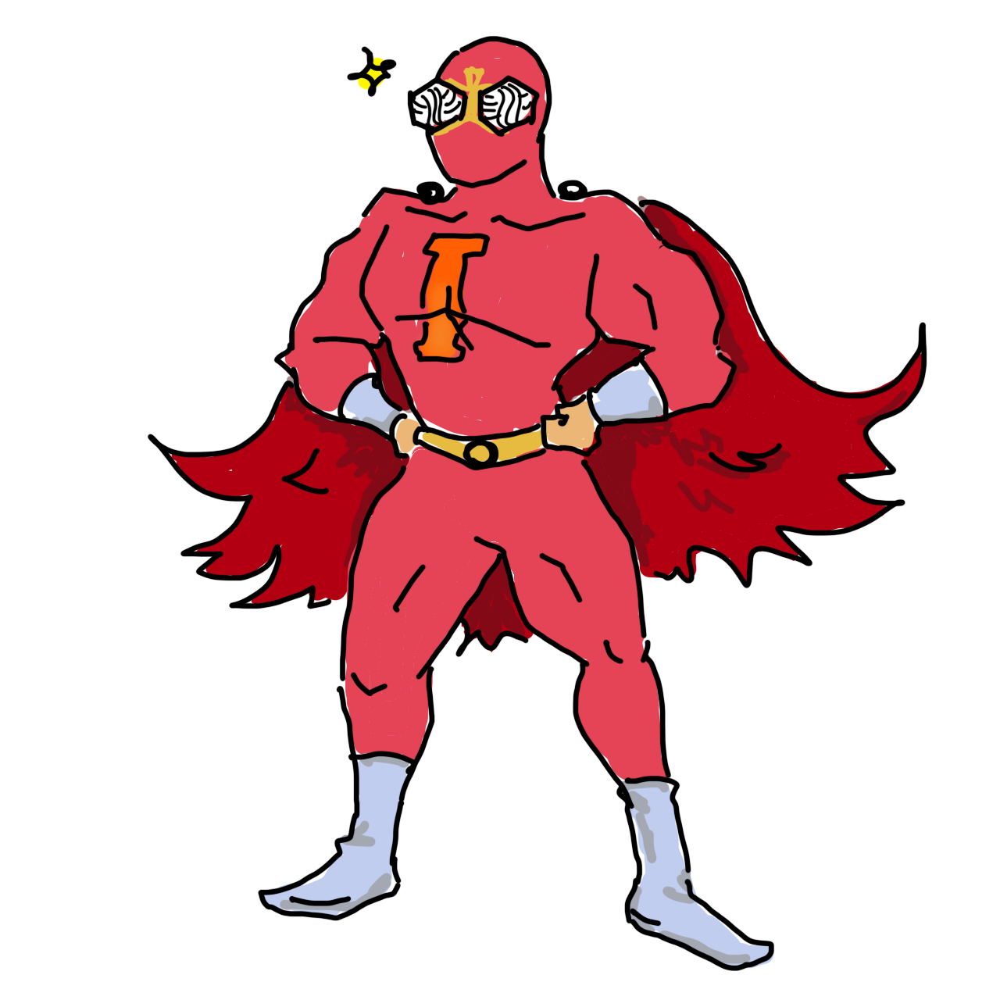
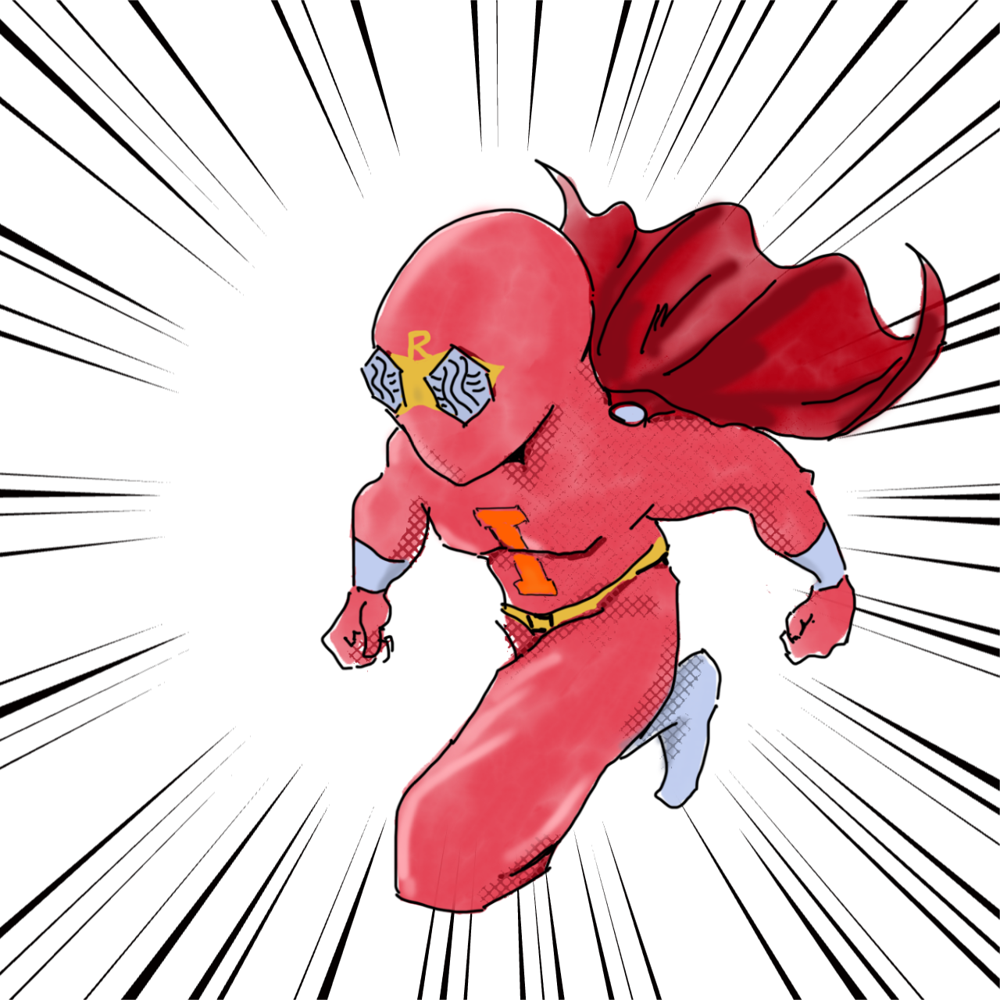
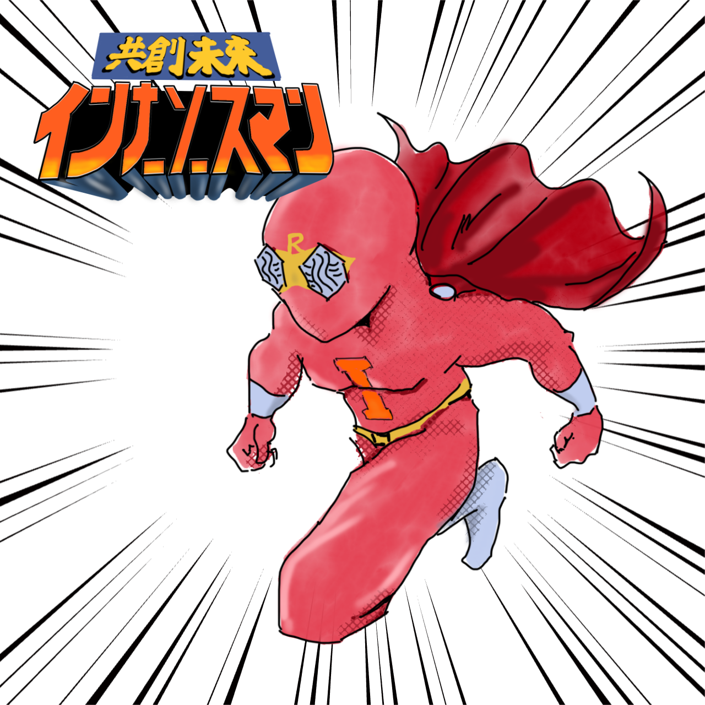
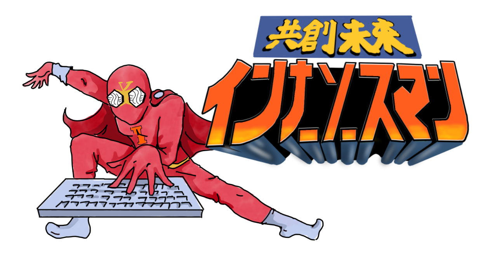
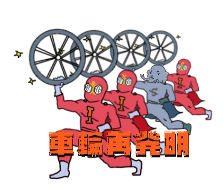
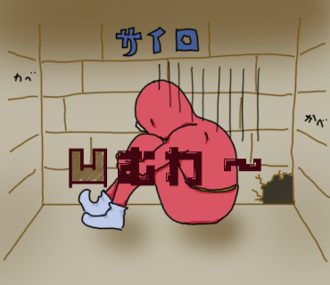

# インナーソースマンイラスト集

このリポジトリには、インナーソースマンのさまざまなイラストが含まれています。これらのイラストは、インナーソースの概念や価値を視覚的に表現するために作成されました。

## イラストギャラリー

### 基本キャラクター

<table>
  <tr>
    <td align="center" colspan="2">
       
      
InnerSource Man (Basic)

      <a href="./character/slim-large.png" download>Download Large</a> | 
      <a href="./character/character-no-text.png" download>Download Small</a> 
      <small>No Text Version</small>
    </td>
    <td align="center" colspan="2">
       
      
InnerSource Man (Muscle)

      <a href="./character/muscle-large.png" download>Download Large</a> | 
      <a href="./character/character-no-text-muscle.png" download>Download Small</a> 
      <small>Muscle Version</small>
    </td>
  </tr>
</table>

### 動的キャラクター

<table>
  <tr>
    <td align="center">
       
      
InnerSource Man (Running)

      <a href="./character/dash-large.png" download>Download Large</a> 
      <small>動いているバージョン</small>
    </td>
    <td align="center">
       
      
InnerSource Man (Running with Logo)

      <a href="./character/dash-with-logo-large.png" download>Download Large</a> 
      <small>ロゴ付き動きバージョン</small>
    </td>
  </tr>
</table>

### シーン別イラスト

<table>
  <tr>
    <td align="center">
       
      
Copy and Paste

      <a href="./character/copy-paste-large.png" download>Download Large</a> | 
      <a href="./character/character-copy.png" download>Download Small</a> 
      <small>コピー&ペーストの表現</small>
    </td>
    <td align="center">
       
      
Copy and Paste with Logo

      <a href="./character/copy-paste-with-logo-large.png" download>Download Large</a> 
      <small>ロゴ付きコピー&ペーストの表現</small>
    </td>
    <td align="center">
       
      
LGTM (Looks Good To Me)

      <a href="./character/LGTM.png" download>Download</a> 
      <small>「良さそう」</small>
    </td>
  </tr>
</table>

<table>
  <tr>
    <td align="center">
       
      
Let's make it InnerSource

      <a href="./character/lets-make-it-innersource.png" download>Download</a> 
      <small>「それ、インナーソースにしよう」</small>
    </td>
    <td align="center">
       
      
Thanks for README

      <a href="./character/thanks-for-readme.png" download>Download</a> 
      <small>「README.mdありがてぇ」</small>
    </td>
    <td align="center">
       
      
No README

      <a href="./character/no-readme.png" download>Download</a> 
      <small>「READMEがない」</small>
    </td>
  </tr>
  <tr>
    <td align="center">
       
      
Reinventing the Wheel

      <a href="./character/reinventing-the-wheel.png" download>Download</a> 
      <small>「インナーソースマン車輪再発明」</small>
    </td>
    <td align="center">
       
      
Feeling Down

      <a href="./character/feeling-down.png" download>Download</a> 
      <small>「凹むわ〜」</small>
    </td>
    <td align="center">
       
      
Putting Away

      <a href="./character/putting-away-man.png" download>Download</a> 
      <small>「しまっちゃうおじさん」</small>
    </td>
  </tr>
</table>

### ロゴ

<table>
  <tr>
    <td align="center">
       
      
InnerSource Man Logo

      <a href="./logo/innersource-man-logo-large.png" download>Download Large</a> | 
      <a href="./logo/innersource-man-logo-small.png" download>Download Small</a> 
      <small>Logo Version</small>
    </td>
  </tr>
</table>

## 詳細情報

- [キャラクターイラスト詳細](./character/)
- [ロゴイラスト詳細](./logo/)

## 使用方法

これらのイラストは以下のような用途でご利用いただけます：
- プレゼンテーション
- ドキュメント
- ウェブサイト
- イベント資料
- チャットやメッセージでのリアクション画像
- ブログ記事の挿絵
- プルリクエストやコードレビューでのLGTMスタンプ

## ライセンス

このイラスト集はCC BY-NC-ND 4.0ライセンスの下で提供されています。
