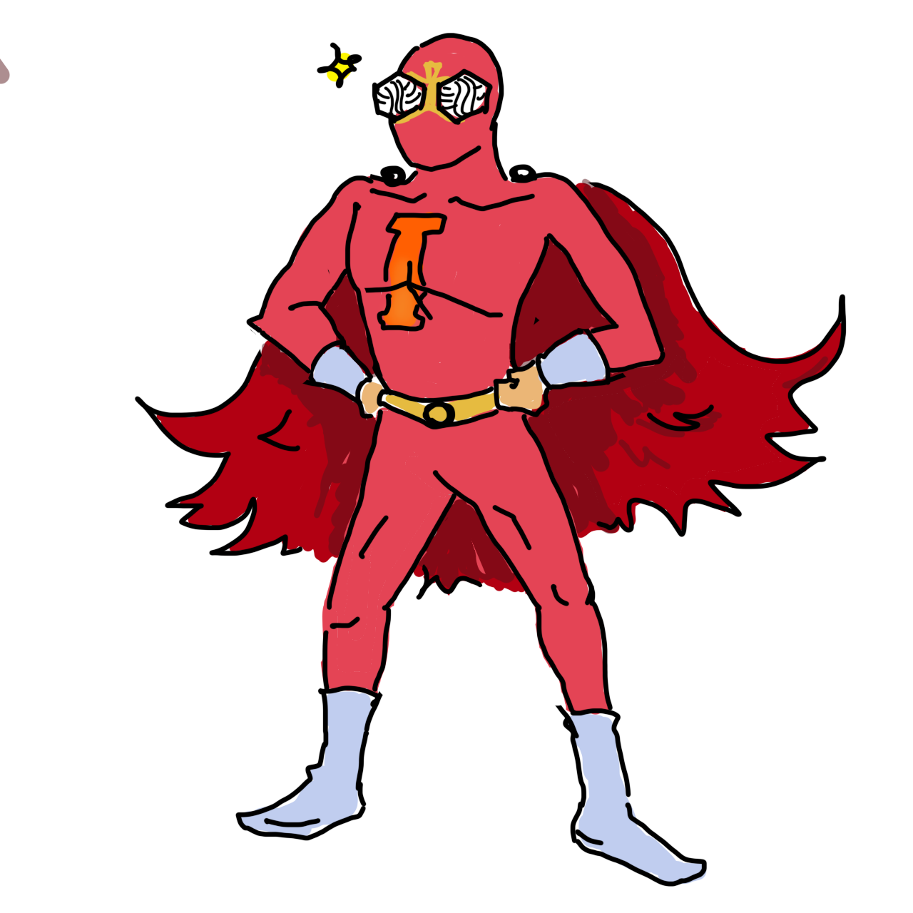
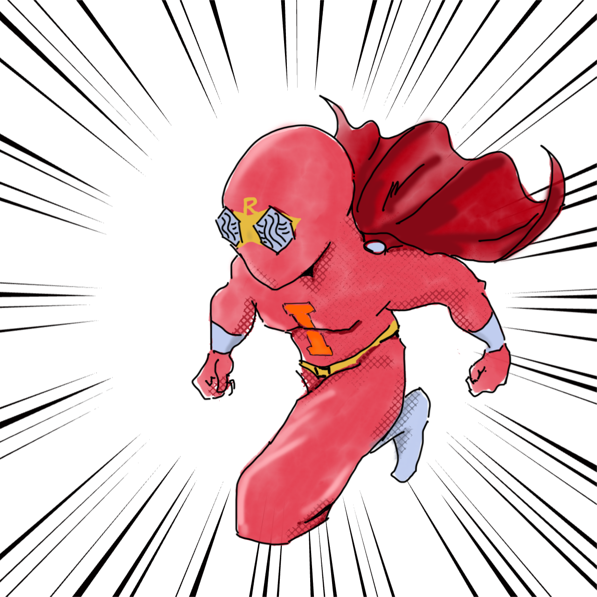
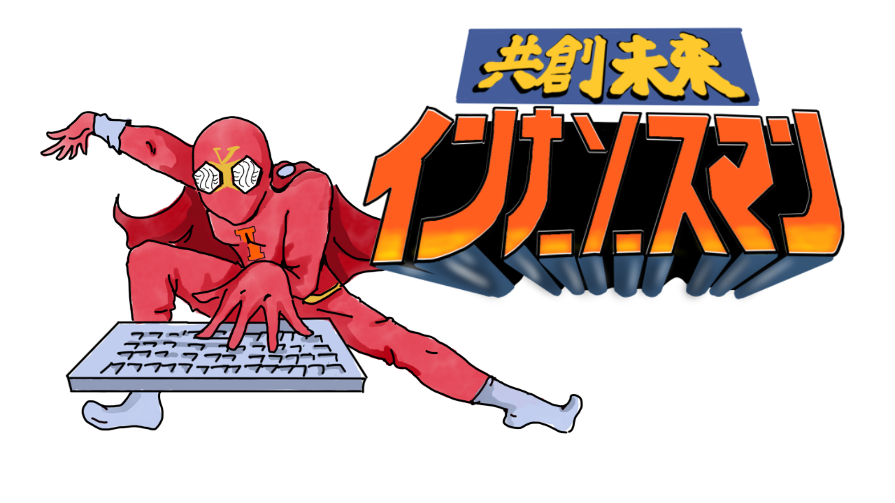

# InnerSource Man Character Illustrations

インナーソースマン（InnerSource Man）のキャラクターイラスト集です。

## イラストギャラリー

### 基本キャラクター

<table>
  <tr>
    <td align="center" colspan="2">
       
      
InnerSource Man (Basic)

      <a href="./slim-large.png" download>Download Large</a> | 
      <a href="./character-no-text.png" download>Download Small</a> 
      <small>No Text Version</small>
    </td>
    <td align="center" colspan="2">
       
      
InnerSource Man (Muscle)

      <a href="./muscle-large.png" download>Download Large</a> | 
      <a href="./character-no-text-muscle.png" download>Download Small</a> 
      <small>Muscle Version</small>
    </td>
  </tr>
</table>

### 動的キャラクター

<table>
  <tr>
    <td align="center">
       
      
InnerSource Man (Running)

      <a href="./dash-large.png" download>Download Large</a> 
      <small>動いているバージョン</small>
    </td>
    <td align="center">
       
      
InnerSource Man (Running with Logo)

      <a href="./dash-with-logo-large.png" download>Download Large</a> 
      <small>ロゴ付き動きバージョン</small>
    </td>
  </tr>
</table>

### シーン別イラスト

<table>
  <tr>
    <td align="center">
       
      
Copy and Paste

      <a href="./copy-paste-large.png" download>Download Large</a> | 
      <a href="./character-copy.png" download>Download Small</a> 
      <small>コピー&ペーストの表現</small>
    </td>
    <td align="center">
       
      
Copy and Paste with Logo

      <a href="./copy-paste-with-logo-large.png" download>Download Large</a> 
      <small>ロゴ付きコピー&ペーストの表現</small>
    </td>
    <td align="center">
       
      
Let's make it InnerSource

      <a href="./lets-make-it-innersource.png" download>Download</a> 
      <small>「それ、インナーソースにしよう」</small>
    </td>
  </tr>
  <tr>
    <td align="center">
       
      
Thanks for README

      <a href="./thanks-for-readme.png" download>Download</a> 
      <small>「README.mdありがてぇ」</small>
    </td>
    <td align="center">
       
      
No README

      <a href="./no-readme.png" download>Download</a> 
      <small>「READMEがない」</small>
    </td>
    <td align="center">
       
      
Reinventing the Wheel

      <a href="./reinventing-the-wheel.png" download>Download</a> 
      <small>「インナーソースマン車輪再発明」</small>
    </td>
  </tr>
  <tr>
    <td align="center">
       
      
Feeling Down

      <a href="./feeling-down.png" download>Download</a> 
      <small>「凹むわ〜」</small>
    </td>
    <td align="center">
       
      
Putting Away

      <a href="./putting-away-man.png" download>Download</a> 
      <small>「しまっちゃうおじさん」</small>
    </td>
    <td align="center">
       
      
LGTM (Looks Good To Me)

      <a href="./lgtm.png" download>Download</a> 
      <small>「良さそう」</small>
    </td>
  </tr>
</table>

## 使用例

- チームプレゼンテーションでのインナーソース概念の説明
- 社内イベントでのポスターやバナー
- ドキュメントの挿絵
- チャットやメッセージでのリアクション画像
- ブログ記事の挿絵
- プルリクエストやコードレビューでのLGTMスタンプ

## 今後のバリエーション予定

- さらに多くのシーン別イラストの追加
- 新しい状況やメッセージのバリエーション
- アイコンスタイルのバージョン

## ライセンス

このイラストコレクションはCC BY-NC-ND 4.0ライセンスの下で提供されています。
