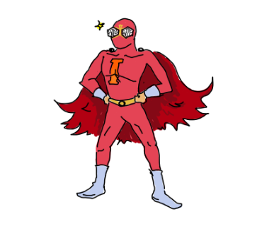
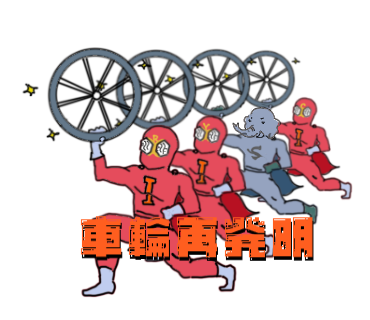

# InnerSource Man Character Illustrations

インナーソースマン（InnerSource Man）のキャラクターイラスト集です。

## イラストギャラリー

### 基本キャラクター

<table>
  <tr>
    <td align="center">
       
      <a href="./character-no-text.png" download>InnerSource Man (Basic)</a> 
      <small>No Text Version</small>
    </td>
    <td align="center">
       
      <a href="./character-no-text-muscle.png" download>InnerSource Man (Muscle)</a> 
      <small>Muscle Version</small>
    </td>
    <td align="center">
       
      <a href="./character-copy.png" download>InnerSource Man (Copy)</a> 
      <small>Full Version</small>
    </td>
  </tr>
</table>

### シーン別イラスト

<table>
  <tr>
    <td align="center">
       
      <a href="./lets-make-it-innersource.png" download>Let's make it InnerSource</a> 
      <small>「それ、インナーソースにしよう」</small>
    </td>
    <td align="center">
       
      <a href="./thanks-for-readme.png" download>Thanks for README</a> 
      <small>「README.mdありがてぇ」</small>
    </td>
    <td align="center">
       
      <a href="./no-readme.png" download>No README</a> 
      <small>「READMEがない」</small>
    </td>
  </tr>
  <tr>
    <td align="center">
       
      <a href="./reinventing-the-wheel.png" download>Reinventing the Wheel</a> 
      <small>「インナーソースマン車輪再発明」</small>
    </td>
    <td align="center">
       
      <a href="./feeling-down.png" download>Feeling Down</a> 
      <small>「凹むわ〜」</small>
    </td>
    <td align="center">
       
      <a href="./putting-away-man.png" download>Putting Away</a> 
      <small>「しまっちゃうおじさん」</small>
    </td>
  </tr>
</table>

## 使用例

- チームプレゼンテーションでのインナーソース概念の説明
- 社内イベントでのポスターやバナー
- ドキュメントの挿絵
- チャットやメッセージでのリアクション画像
- ブログ記事の挿絵

## 今後のバリエーション予定

- 各シーン別イラストの大中小サイズ
- 新しい状況やメッセージのバリエーション
- アイコンスタイルのバージョン

## ライセンス

このイラストコレクションはCC BY-NC-ND 4.0ライセンスの下で提供されています。
